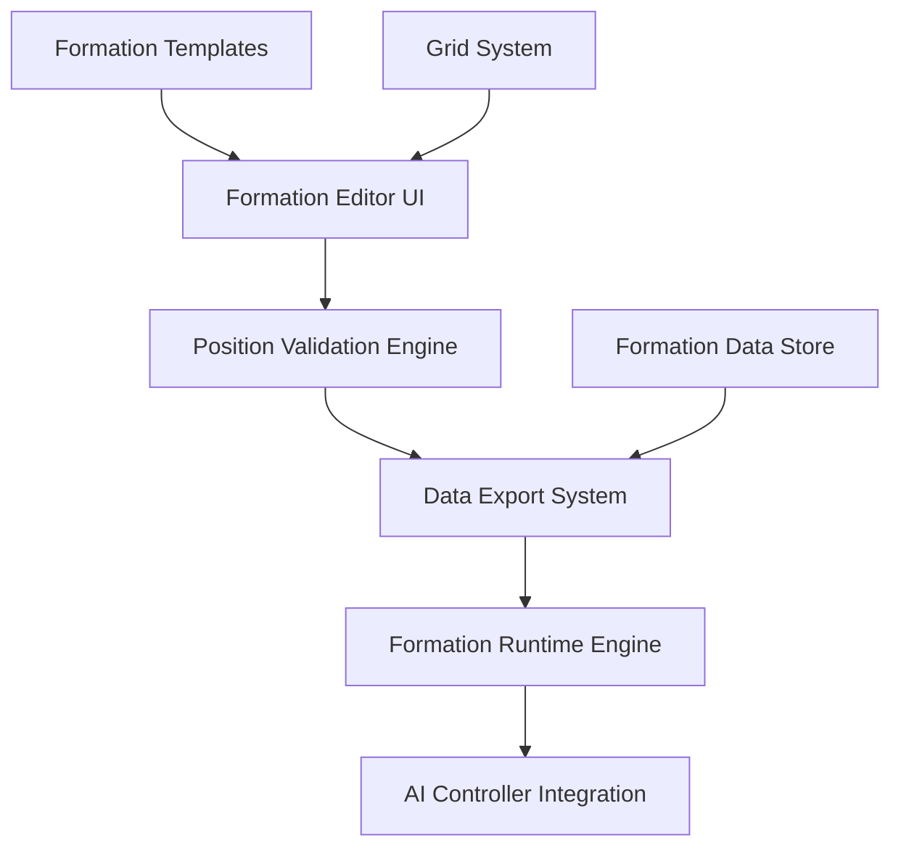

# Formation Editor Tool (FET) - Technical Design Document

**Project**: Super Soccer Manager: Pro Edition
**Document Version**: 1.0
**Date**: 13 August 2025
**Target Phase**: Phase 2 Implementation

## 1. Executive Summary

The Formation Editor Tool (FET) is a developer-only application for creating sophisticated AI positioning data that drives tactical player behaviour in Super Soccer Manager. This tool enables precise mapping of player positions relative to ball location across all standard football formations, creating rich datasets for intelligent player movement during matches.

## 2. System Architecture

### 2.1 High-Level Architecture



### 2.2 Core Components

#### 2.2.1 Formation Editor UI
- **Technology**: React with Canvas for pitch visualisation
- **Responsibilities**: Visual formation editing, player positioning, real-time preview
- **Input Methods**: Mouse drag-and-drop, keyboard shortcuts, template selection

#### 2.2.2 Grid System Engine
- **Grid Density**: 20x15 grid (300 zones total)
- **Zone Dimensions**: 5.25m x 6.8m per zone in real pitch space
- **Coordinate System**: Normalised coordinates (0.0-1.0) for pitch width/length
- **Performance**: O(1) zone lookup using spatial hashing

#### 2.2.3 Position Validation Engine
- **Rule Validation**: Offside positioning, minimum spacing, role appropriateness
- **Performance Checks**: Memory usage estimation, CPU overhead analysis
- **Real-time Feedback**: Instant validation with visual error indicators

## 3. Data Architecture

### 3.1 Core Data Structures

```typescript
interface FormationData {
  formationId: string;           // "4-4-2-flat"
  name: string;                  // "4-4-2 Flat Formation"
  category: FormationCategory;   // "Defensive" | "Balanced" | "Attacking"
  phases: {
    [phase in GamePhase]: PhaseData;
  };
  metadata: FormationMetadata;
}

interface PhaseData {
  positions: {
    [zoneId: string]: {          // "x12_y8" format
      players: {
        [playerRole: string]: {   // "CB_LEFT", "CDM", "RW" etc.
          x: number;             // 0.0-1.0 normalised
          y: number;             // 0.0-1.0 normalised
          priority: number;      // 1-10 positioning importance
          flexibility: number;   // 0.0-1.0 deviation allowed
          contextualModifiers: ContextualModifier[];
        }
      }
    }
  };
}

interface ContextualModifier {
  condition: ModifierCondition;
  positionDelta: { x: number; y: number };
  priorityMultiplier: number;
}

interface ModifierCondition {
  opponentFormation?: string;
  matchSituation?: 'winning' | 'losing' | 'drawing';
  timeRemaining?: number;
  playerStamina?: number;
}

enum GamePhase {
  ATTACK = "attack",
  DEFEND = "defend",
  TRANSITION_ATTACK = "transition_attack",
  TRANSITION_DEFEND = "transition_defend",
  SET_PIECE_FOR = "set_piece_for",
  SET_PIECE_AGAINST = "set_piece_against"
}
```

### 3.2 Optimised Storage Format

```typescript
// Compressed format for runtime efficiency
interface CompactFormationData {
  id: string;
  phases: {
    [phase: string]: CompactPhaseData;
  };
}

interface CompactPhaseData {
  // Positions stored as packed arrays for memory efficiency
  zones: Uint8Array;           // Zone indices
  positions: Float32Array;     // x,y coordinates (interleaved)
  priorities: Uint8Array;      // Priority values 1-10
  flexibility: Uint8Array;     // Flexibility * 100 (0-100)
}
```

## 4. Grid System Implementation

### 4.1 Optimized Spatial Indexing

```typescript
class OptimizedGridSystem {
  private readonly GRID_WIDTH = 20;
  private readonly GRID_HEIGHT = 15;
  private readonly ZONE_COUNT = 300;

  // Hybrid approach: Integer indices + Float32Array positions
  private spatialIndex: Map<number, ZoneData> = new Map();  // Integer keys for exact lookup
  private positionBuffer: Float32Array;                      // SIMD-friendly position storage
  private interpolationBuffer: Float32Array;                 // Working space for bulk operations

  constructor() {
    // Pre-allocate SIMD-optimized buffers for 22 players
    this.positionBuffer = new Float32Array(44);        // x,y interleaved (22 * 2)
    this.interpolationBuffer = new Float32Array(16);   // Temporary calculation space
  }

  // Integer operations for exact grid calculations (cache-friendly)
  public getZoneIndex(x: number, y: number): number {
    const gridX = Math.floor(x * this.GRID_WIDTH);
    const gridY = Math.floor(y * this.GRID_HEIGHT);
    return gridY * this.GRID_WIDTH + gridX;  // Single integer index (0-299)
  }

  // Legacy string-based API for compatibility
  public getZoneId(x: number, y: number): string {
    const index = this.getZoneIndex(x, y);
    const gridX = index % this.GRID_WIDTH;
    const gridY = Math.floor(index / this.GRID_WIDTH);
    return `x${gridX}_y${gridY}`;
  }

  // Optimized zone center calculation using integer index
  public getZoneCenter(zoneIndex: number): Float32Array {
    const gridX = zoneIndex % this.GRID_WIDTH;
    const gridY = Math.floor(zoneIndex / this.GRID_WIDTH);

    // Use Float32Array for potential SIMD operations
    const center = new Float32Array(2);
    center[0] = (gridX + 0.5) / this.GRID_WIDTH;
    center[1] = (gridY + 0.5) / this.GRID_HEIGHT;
    return center;
  }

  // Legacy API for compatibility
  public getZoneCenterLegacy(zoneId: string): { x: number; y: number } {
    const [, xStr, yStr] = zoneId.match(/x(\d+)_y(\d+)/) || [];
    const gridX = parseInt(xStr);
    const gridY = parseInt(yStr);

    return {
      x: (gridX + 0.5) / this.GRID_WIDTH,
      y: (gridY + 0.5) / this.GRID_HEIGHT
    };
  }

  // Optimized nearby zone calculation using integer arithmetic
  public getNearbyZoneIndices(zoneIndex: number, radius: number = 1): number[] {
    const nearby: number[] = [];
    const centerX = zoneIndex % this.GRID_WIDTH;
    const centerY = Math.floor(zoneIndex / this.GRID_WIDTH);

    for (let dx = -radius; dx <= radius; dx++) {
      for (let dy = -radius; dy <= radius; dy++) {
        const newX = centerX + dx;
        const newY = centerY + dy;

        if (newX >= 0 && newX < this.GRID_WIDTH &&
            newY >= 0 && newY < this.GRID_HEIGHT) {
          nearby.push(newY * this.GRID_WIDTH + newX);
        }
      }
    }

    return nearby;
  }

  // Bulk position interpolation using Float32Array (SIMD potential)
  public bulkInterpolatePositions(
    ballPosition: Float32Array,  // [x, y]
    targetPositions: Float32Array,  // [x1, y1, x2, y2, ...]
    weights: Float32Array,  // [w1, w2, ...]
    outputPositions: Float32Array  // Output buffer
  ): void {
    // Pattern optimizable by V8's TurboFan JIT for NEON generation
    const ballX = ballPosition[0];
    const ballY = ballPosition[1];

    for (let i = 0; i < targetPositions.length; i += 2) {
      const weight = weights[i >> 1];  // Bit shift for divide by 2
      const invWeight = 1.0 - weight;

      outputPositions[i] = targetPositions[i] * weight + ballX * invWeight;
      outputPositions[i + 1] = targetPositions[i + 1] * weight + ballY * invWeight;
    }
  }
}
```

### 4.2 SIMD-Optimized Position Interpolation

**Numeric Strategy Rationale:**
- **Integer Grid Indices**: Exact calculations, cache-friendly, no floating-point precision issues
- **Float32Array Positions**: SIMD potential on ARM NEON, memory-efficient for bulk operations
- **Hybrid Approach**: Combines precision (integers) with performance (SIMD floats)

```typescript
class SIMDPositionInterpolator {
  private formationData: FormationData;
  private gridSystem: OptimizedGridSystem;
  private interpolationCache: LRUCache<string, Vector2>;

  public getInterpolatedPosition(
    playerRole: string,
    ballPosition: Vector2,
    gamePhase: GamePhase,
    context: GameContext
  ): Vector2 {
    const cacheKey = this.getCacheKey(playerRole, ballPosition, gamePhase);

    if (this.interpolationCache.has(cacheKey)) {
      return this.interpolationCache.get(cacheKey)!;
    }

    const ballZoneIndex = this.gridSystem.getZoneIndex(ballPosition.x, ballPosition.y);
    const phaseData = this.formationData.phases[gamePhase];

    // Get direct position if available (convert index back to string for data access)
    const ballZoneId = this.gridSystem.getZoneId(ballPosition.x, ballPosition.y);
    const directPosition = phaseData.positions[ballZoneId]?.players[playerRole];
    if (directPosition) {
      const result = this.applyContextualModifiers(directPosition, context);
      this.interpolationCache.set(cacheKey, result);
      return result;
    }

    // Interpolate from nearby zones using optimized integer indices
    const nearbyIndices = this.gridSystem.getNearbyZoneIndices(ballZoneIndex, 2);
    const nearbyZones = nearbyIndices.map(idx =>
      this.gridSystem.getZoneId(0, 0) // Convert indices back to IDs for compatibility
    ).filter(Boolean);
    const weightedPositions: Array<{ position: Vector2; weight: number }> = [];

    for (const zoneId of nearbyZones) {
      const zoneData = phaseData.positions[zoneId];
      const playerPosition = zoneData?.players[playerRole];

      if (playerPosition) {
        const distance = this.getZoneDistance(ballZoneId, zoneId);
        const weight = 1 / (1 + distance);

        weightedPositions.push({
          position: { x: playerPosition.x, y: playerPosition.y },
          weight
        });
      }
    }

    const interpolated = this.calculateWeightedAverage(weightedPositions);
    const result = this.applyContextualModifiers(interpolated, context);

    this.interpolationCache.set(cacheKey, result);
    return result;
  }

  private calculateWeightedAverage(
    positions: Array<{ position: Vector2; weight: number }>
  ): Vector2 {
    if (positions.length === 0) {
      return { x: 0.5, y: 0.5 }; // Default center position
    }

    const totalWeight = positions.reduce((sum, p) => sum + p.weight, 0);
    const weightedX = positions.reduce((sum, p) => sum + p.position.x * p.weight, 0);
    const weightedY = positions.reduce((sum, p) => sum + p.position.y * p.weight, 0);

    return {
      x: weightedX / totalWeight,
      y: weightedY / totalWeight
    };
  }
}
```

### 4.3 Opposition Mirroring Model (Ghost Opposition)

The editor supports visualising an opposition team using a deterministic mirroring model that reflects both ball position and formation mappings to the other half, preserving tactical intent.

- Mirroring axis: halfway line (horizontal, Y-axis). Positions are mirrored as: `y' = 1 - y`, `x' = x`.
- Cell mirroring: for a grid with `rows`, a cell `(c, r)` maps to `(c, rows - 1 - r)`.
- Mapping source: when the ball is in cell `(c, r)`, the opposition (ghost) displays the user's mapping for the mirrored cell `(c, rows - 1 - r)`, then mirrors those positions across the halfway line.
- Priority: staged mapping for the mirrored cell → committed mapping for the mirrored cell → active posture base → base roles.

Rationale: This ensures cells configured in your defensive third become the opposition's defensive-third reference, maintaining tactical symmetry when visualising both sides.

 Ghost Opposition UI rules:
- Ghost markers render with dashed outlines and reduced opacity.
- Ghost markers are non-interactive in Ghost mode (view-only); primary team remains editable and appears above ghosts.
- Ghost markers update live with ball movement and when user edits their team's roles or cell mappings.

## 5. Runtime Integration

### 5.1 Formation Engine

```typescript
class FormationEngine {
  private formationData: Map<string, FormationData> = new Map();
  private positionInterpolator: PositionInterpolator;
  private performanceMonitor: PerformanceMonitor;

  constructor(formations: FormationData[]) {
    formations.forEach(formation => {
      this.formationData.set(formation.formationId, formation);
    });

    this.positionInterpolator = new PositionInterpolator();
    this.performanceMonitor = new PerformanceMonitor();
  }

  public getOptimalPosition(
    player: Player,
    gameState: GameState,
    tacticalCommand?: TacticalCommand
  ): Vector2 {
    const startTime = performance.now();

    try {
      const formation = this.getActiveFormation(player.team);
      const gamePhase = this.determineGamePhase(gameState, player.team);
      const context = this.buildGameContext(gameState, tacticalCommand);

      const position = this.positionInterpolator.getInterpolatedPosition(
        player.playerType,
        gameState.ball.position,
        gamePhase,
        context
      );

      return this.applyFlexibilityAndConstraints(player, position, gameState);

    } finally {
      const executionTime = performance.now() - startTime;
      this.performanceMonitor.recordPositionCalculation(executionTime);
    }
  }

  private determineGamePhase(gameState: GameState, team: Team): GamePhase {
    const possession = gameState.possession;
    const ballPosition = gameState.ball.position;

    if (possession === team.id) {
      return ballPosition.y > 0.6 ? GamePhase.ATTACK : GamePhase.TRANSITION_ATTACK;
    } else {
      return ballPosition.y < 0.4 ? GamePhase.DEFEND : GamePhase.TRANSITION_DEFEND;
    }
  }

  private applyFlexibilityAndConstraints(
    player: Player,
    targetPosition: Vector2,
    gameState: GameState
  ): Vector2 {
    // Apply player-specific flexibility
    const flexibility = this.getPlayerFlexibility(player);
    const noise = this.generatePositionalNoise(flexibility);

    let adjustedPosition = {
      x: targetPosition.x + noise.x,
      y: targetPosition.y + noise.y
    };

    // Apply constraints (pitch boundaries, collision avoidance)
    adjustedPosition = this.applyPitchBoundaries(adjustedPosition);
    adjustedPosition = this.applyCollisionAvoidance(adjustedPosition, gameState);

    return adjustedPosition;
  }
}
```

### 5.2 AI Controller Integration

```typescript
class FormationAwareAIController extends BasicAIController {
  private formationEngine: FormationEngine;
  private movementSmoothing: MovementSmoother;

  constructor(formationData: FormationData[]) {
    super();
    this.formationEngine = new FormationEngine(formationData);
    this.movementSmoothing = new MovementSmoother();
  }

  public updatePlayerBehaviour(player: Player, gameState: GameState): void {
    // Get formation-based target position
    const formationTarget = this.formationEngine.getOptimalPosition(
      player,
      gameState,
      gameState.tacticalCommand
    );

    // Apply immediate tactical overrides
    const tacticalTarget = this.applyTacticalOverrides(
      formationTarget,
      player,
      gameState
    );

    // Smooth movement to prevent jittery positioning
    player.targetPosition = this.movementSmoothing.smoothPosition(
      player.position,
      tacticalTarget,
      player.attributes.agility
    );

    // Execute base AI behaviour with formation context
    super.updatePlayerBehaviour(player, gameState);
  }

  private applyTacticalOverrides(
    formationPosition: Vector2,
    player: Player,
    gameState: GameState
  ): Vector2 {
    // Override formation position for immediate tactical needs

    // 1. Ball carrier support
    if (this.shouldSupportBallCarrier(player, gameState)) {
      return this.calculateSupportPosition(player, gameState);
    }

    // 2. Defensive pressing
    if (this.shouldPress(player, gameState)) {
      return this.calculatePressPosition(player, gameState);
    }

    // 3. Marking assignment
    const markingTarget = this.getMarkingTarget(player, gameState);
    if (markingTarget) {
      return this.calculateMarkingPosition(player, markingTarget);
    }

    // Default to formation position
    return formationPosition;
  }
}
```

## 6. Runtime Contract and Integration

### 6.1 Export Schema and Versioning

```typescript
interface FormationExport {
  schemaVersion: string;        // "1.0.0" semantic versioning
  formatVersion: number;        // Breaking change indicator
  exportTimestamp: string;      // ISO 8601 timestamp
  formations: FormationData[];
  metadata: ExportMetadata;
}

interface ExportMetadata {
  author: string;
  description: string;
  gameVersion: string;
  compatibilityFlags: string[];  // ["POC", "Phase2", "Phase3"]
}
```

**Storage Location**: `assets/formations/` directory in repository
**File Format**: Compressed JSON with `.formation` extension
**Versioning Policy**:
- Major version changes require TDD updates
- Minor versions maintain backward compatibility
- Runtime validates format version on load

**Breaking Change Protocol**:
1. Increment `formatVersion` number
2. Maintain parser for previous version (N-1)
3. Add migration path for existing formations
4. Update compatibility documentation

### 6.4 File Types

- Formation File (`.formation.json`): Minimal, engine-ready formation definition (`FormationData`).
- Project File (`.project.json`): Editor working state containing grid, posture, ball, and per-cell mappings (`EditorDoc`). Used for iterative authoring; not required at runtime.

## 7. User Interface Specifications

### 7.1 Editor Interface

```typescript
interface FETUserInterface {
  components: {
    PitchCanvas: CanvasComponent;        // Main editing area
    FormationSelector: SelectComponent;  // Formation templates
    PlayerRolePanel: PanelComponent;     // Role assignments
    ValidationPanel: PanelComponent;     // Error display
    PreviewControls: ControlComponent;   // Animation preview
    ExportPanel: PanelComponent;         // Data export options
    GhostOppositionToggle: ToggleComponent; // Enables mirrored opposition view
    ProjectAutosave: ServiceComponent;   // Periodic autosave to local storage
  };

  interactions: {
    dragAndDrop: DragDropHandler;
    keyboardShortcuts: KeyboardHandler;
    multiSelection: SelectionHandler;
    undoRedo: HistoryHandler;
    ghostView: {
      toggle: () => void;               // Enable/disable ghost view
      behavior: "view-only";            // Ghost is visible but not editable
      updateModel: "mirror-halfway";    // Mirrors ball cell and positions across halfway line
    }
    project: {
      save: () => void;                 // Manual save
      load: () => void;                 // Load from file
      autosaveIntervalMs: number;       // e.g. 5000ms
      storageKey: string;               // namespaced key for local storage
    }
  };
}
```

### 7.2 Validation Interface

```typescript
interface ValidationResult {
  isValid: boolean;
  errors: ValidationError[];
  warnings: ValidationWarning[];
  suggestions: ValidationSuggestion[];
}

interface ValidationError {
  type: 'OFFSIDE' | 'OVERLAP' | 'MISSING_PLAYER' | 'OUT_OF_BOUNDS';
  playerRole: string;
  zone: string;
  message: string;
  severity: 'ERROR' | 'WARNING' | 'INFO';
}
```

## 8. MVP Tightening (Phase 2 Guidance)

### 8.1 Phase 2A: Core Editor (Months 4-5)
**Strict Scope Limitations**:
- **Single Formation Category**: Balanced formations only (defer Defensive/Attacking)
- **Single Grid Density**: 20x15 fixed (no dynamic scaling)
- **Two Game Phases**: ATTACK/DEFEND only (defer transitions and set pieces)
- **JSON Export/Import**: Basic serialization without versioning
- **Base Validations**: Bounds checking and overlap detection only

### 9.2 Phase 2B: Enhanced Features (Month 6)
**Incremental Additions**:
- **Transition Phases**: Add TRANSITION_ATTACK/TRANSITION_DEFEND
- **Set Piece Variants**: Corner and throw-in positioning
- **Basic Caching**: Simple LRU cache for frequent lookups
- **Formation Analytics**: Basic coverage percentage calculation

**Explicitly Deferred**:
- Plugin architecture and extensibility
- Machine learning suggestions and optimization
- Advanced coverage metrics and heat map generation
- Version control and collaboration features

## 9. Development Phases

### 9.1 Phase 2A: Core Editor (Months 4-5)
- Basic drag-and-drop formation editor
- Grid system implementation
- Position validation engine
- Formation template system
- Export/import functionality

### 8.2 Phase 2B: Advanced Features (Month 6)
- Multi-phase formation support
- Performance optimisation
- Advanced validation rules
- Formation testing simulation
- Integration with AI controller

### 8.3 Phase 3: Professional Features (Months 7-8)
- Formation analytics and effectiveness metrics
- A/B testing framework
- Version control system
- Plugin architecture for extensibility
- Machine learning formation suggestions

## 9. Testing Strategy

### 9.1 Unit Testing
- Position calculation accuracy
- Grid system zone mapping
- Data serialisation/deserialisation
- Performance benchmark validation

### 9.2 Integration Testing
- AI controller integration
- Formation switching during gameplay
- Memory usage under load
- Real-time position updates

### 9.3 Performance Testing
- 22 players positioning simultaneously
- Formation data loading/caching
- Memory leak detection
- CPU usage profiling

## 10. Risk Assessment

### 10.1 Technical Risks

| Risk | Impact | Probability | Mitigation |
|------|--------|-------------|------------|
| Performance targets not met | High | Medium | Early prototyping, incremental optimisation |
| Memory usage exceeds limits | High | Low | Compression algorithms, efficient data structures |
| Complex formations break AI | Medium | Medium | Extensive validation, fallback positioning |
| Integration complexity | Medium | High | Phased integration, comprehensive testing |

### 10.2 Timeline Risks

| Risk | Impact | Probability | Mitigation |
|------|--------|-------------|------------|
| Scope creep in UI features | Medium | High | Strict requirements freeze, MVP focus |
| AI integration complexity | High | Medium | Parallel development, early integration testing |
| Performance optimisation time | Medium | Medium | Performance-first development approach |

## 11. Future Extensibility

### 11.1 Plugin Architecture

```typescript
interface FormationPlugin {
  name: string;
  version: string;
  process(formationData: FormationData, context: GameContext): FormationData;
  validate(formationData: FormationData): ValidationResult;
}

class FormationPluginManager {
  private plugins: Map<string, FormationPlugin> = new Map();

  public registerPlugin(plugin: FormationPlugin): void {
    this.plugins.set(plugin.name, plugin);
  }

  public processFormation(
    data: FormationData,
    context: GameContext
  ): FormationData {
    let processedData = data;

    for (const plugin of this.plugins.values()) {
      processedData = plugin.process(processedData, context);
    }

    return processedData;
  }
}
```

### 11.2 Machine Learning Integration

- Formation effectiveness analysis
- Automatic position optimisation
- Player role suggestions based on attributes
- Opponent formation counter-suggestions

## 12. Conclusion

The Formation Editor Tool provides a comprehensive foundation for creating sophisticated AI behaviour in Super Soccer Manager. The architecture balances technical sophistication with performance requirements, ensuring smooth real-time gameplay whilst enabling rich tactical depth.

The phased development approach allows for iterative improvement and validation, whilst the extensible architecture supports future enhancements including machine learning and advanced analytics capabilities.